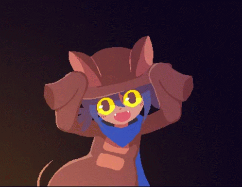
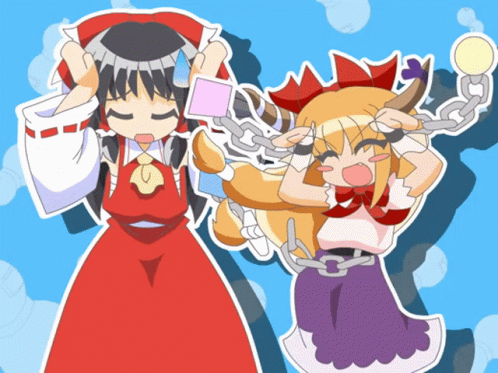

Well… it’s been a year, hasn’t it? I think it’s time I reflected on myself and what I’ve done the whole year.		

I think this year’s been okay, not great, not bad, but okay. I’ve met some new people this year that I’m really grateful to have in my life. I’ve also done a lot of things I regret. A lot of people have, it’s not just me, but I feel like this year I feel like I’ve been deceiving myself in believing I’ve changed as a person, but in reality, I was just sort of ignoring my faults and pretending that I had fixed things, when in reality I didn’t change at all. Last year, I had wanted to make an effort this year to change, but I don’t think I have, and it’s caused some things to happen in my personal life that I only realize now was my own fault. To those people involved, who probably aren’t reading this, I’m really sorry. I now I realize the error of my ways, and I want to put a proper effort in 2023 to become a better person, not just for the people I’ve wronged, but for myself as well. 		

Anyways, sob story out of the way (although I really did mean all that I said), this year had some high and lows. I finally feel somewhat better about moving away and living where I do now. I think my overall mood has gotten better compared to 2021 and 2020, so I am happy about that. I also consumed a lot more varied content this year, so I feel like I broadened my horizons a lot, mainly music, but also movies and stuff too, it makes me feel less disconnected from everyone and like I’m not just stuck with the same taste and all. 		

This year, I also made the website in November, obviously. I think the website honestly hasn’t been anything big in my life like I was kind of expecting it to be, but it’s helped me do something I wanted to do more, which is to write in order to externalize my thoughts more and practice writing. I also used it to expose myself to more artsy and stylistic stuff by making more themes and researching cool stuff to base them off of. Speaking of artsy stuff though, I think the lack of art on the site is disappointing for me, since that was a big aspect I wanted to focus on with this site, but I don’t feel like making art just for the sake of having content. I’ve been working on comic stuff on my own that I don’t feel like talking about right now, because chances are that I could not finish them because of my commitment issues. And I guess that’s another thing I wanted to talk about.			

I have huge commitment issues. I can’t finish personal projects, or keep my motivation or focus on one thing. I’ve been struggling with it a lot this year, and I think I’m starting to get past it just a little. I hope next year, I can somehow overcome this big issue of mine. 		

I want to make next year about personal growth, even if that’s something that happens all the time, but I really want to make a commitment next year to further pursue this. I don’t really do New Years Resolutions, but if I had one, I guess that’s what it would be. 		

I don’t really know how many people are reading my posts on this site, but to those who are, thank you. It really means a lot to have people reading these posts. I hope to improve the site more and to bring more people here. 		

And again to those reading…



<h1 style="font-size: 3em;">Have a Happy New Year!</h1>




     
    

    
        
        
        
        
        
        
        
    
    

     
     


GIF PARTY!!!!!!!!!!!!!!!!