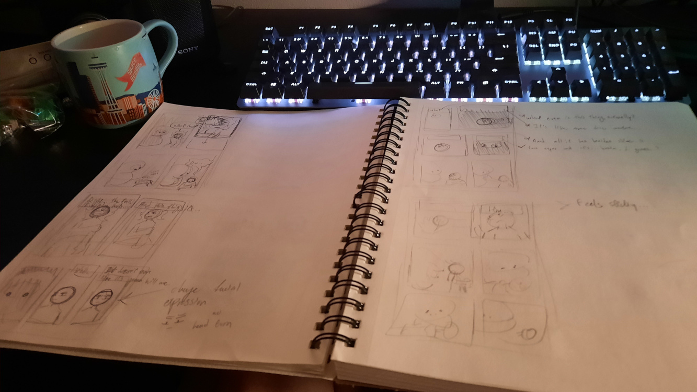
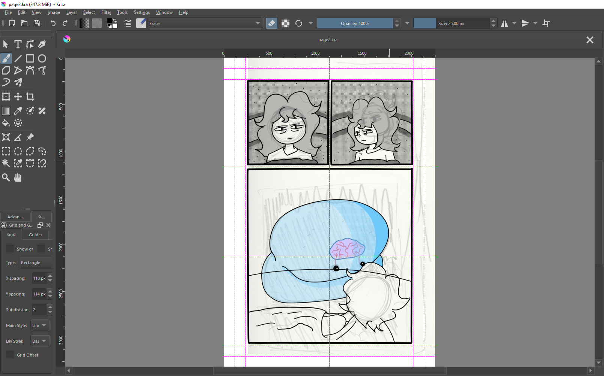
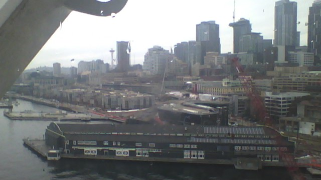
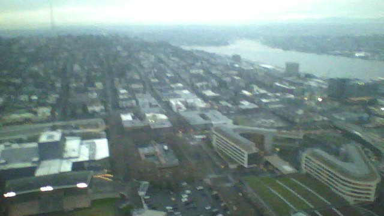

### I'm back! 

...For now.

Also I know this post is technically created on the 31st of December, but it's gonna be finished by the time 2024 starts, so it's a New Years post.

## Where have I been?

Well, I'm not gonna rewrite it again and complicate things. If you didn't read the older posts, tl;dr: I'm busy with my job, along with working on Blip, plus I also have some burnout with the site, so I haven't had the motivation or time to write anything here.

## Will I be writing more soon?

I don't know, maybe? I want to write more, but writing takes time, which I kinda don't have a lot of. Plus with the webcomic taking my time (which I will talk about in a bit), I'm already dedicating time in my day for one project, so another project is a little overwhelming for me. But I will not abandon this site, don't worry all... 2 readers. I will just not post as often.



    <h2 style="font-family: 'Anime Ace'; font-size: 1em;">Working on Blip</h2>
    
I think the first thing I want to talk about in this mega-post is the new webcomic project I've been putting all my time into. It turns out that, man, making one is kinda hard! ESPECIALLY if you're already sort of lazy.

    
The first three chapters took me A YEAR to make (mainly because I started on it, gave up, and picked the project up again), but that should go to show how well I do with big scale projects like these. This project is deceptively big. Apparently, even if you're not a good artist and you don't try to be a perfectionist, it STILL takes a long time to draw out the drafts and panels and stuff, who would've thought?

    
Regardless, I've learned a lot from this project already, but I feel like I still have a long ways to go, which is perfectly fine. This project was created for the goal of self-improvement, so I expect this to not end up great from the start. But I believe in the idea of it, so it doesn't mean I intend to make garbage. I have an idea of where I want to take it and what I want to explore with this project story-wise, so I hope to keep at it!
    

    

        
        
        <b>
Some images of the currently work-in-progress Chapter 6
</b>
    

    
If anyone actually read Blip and have been caught up on it, you may have noticed that I published the new chapter in three weeks instead of two. I think I'm starting to realize that this schedule may not work for me too, which I feel decently guilty about because I see other webcomic artists produce much better results in their weekly schedules, and I can't even keep up a two week schedule with such a lackluster art style and page count. But I don't want to push myself too hard, because I <b>NEED</b> to make sure I don't get burnt out no matter what.

    
So even if I hate it, yeah I can't really promise a schedule, I'm just gonna upload new chapters at my own pace at this point. BUT I PROMISE I will work as much and as fast as possible on new chapters.

    
I would like to write more about Blip and making it, but I want to keep this post concise, so perhaps in a future post, I'll talk about it more. But let's move on.

 




    <h2 style="font-family: 'Pacifico'; text-shadow: none;">Going to Seattle</h2>
    
A few weeks back, a couple of my friends visited from Arizona to see me (and the state of Washington, of course), and one of the main things we got to do while visiting was go into Seattle and explore.

    
One of the first things we did after getting off the bus was ride the Ferris Wheel, since it was the closest thing to us at the time. I even got some pictures while on it, courtesy of my PlayStation Vita B)

     
    

        

            
            <b>
In glorious 480p (not even probably)
</b>
        

    

     
    
After that, we walked around to other places like Pike Place Market, the first Starbucks, Pink Gorilla Games (I bought Persona 4 Golden and Disgaea: Afternoon of Darkness for 40 bucks!), and then, finally... the Space Needle.

     
    

        

            
            <b>
Beautiful view of Seattle
</b>
        

    

     
    
It was getting kinda late, so we went to Dick's Drive-In to top it off, and then took the bus back to the hotel, where I spent the rest of my time watching End of Evangelion with them before saying goodbye.

    
It was a busy and expensive day, but I'm glad I got to spend time with my friends from Arizona. I thought when I moved that I would associate with them less because of the inconvenience of being farther away, but in the end, we're making it work out surprisingly, so I hope to keep things going with them.

 




    <h2>A Reflection</h2>
    
The past year has been interesting, to say the least. I wasn't expecting to be back in Washington at all by the end of 2023, but here I am. That is probably the most significant aspect of this year, but there were other things too, such as me ramping up work on the website, starting my webcomic, graduating high school, etc. It's been a year with a lot of stuff going on, especially outside of my bubble too. Writers/actors strike, the attacks on Palestine, HENRY KISSINGER DEAD LETS GOOOOOOOOO, and more that I can't list off the top of my head. But I think through all this, I've slowly begun to learn more about the world and improve myself as a person through it, learning how to deal with more political and sensitive topics, educating myself on important social subjects, and also more personal things, like utilizing new methods to increase my productivity.

    
I don't like making promises to myself like with New Years Resolutions and all that because I won't keep them, but if there's one goal I have in mind this year, it's to become a more productive person through my personal projects like my webcomic or my site, and to maintain a balance of that and my life. I think if I can figure that out, than I would be pretty satisfied with myself this year.

     

    
...I say this a lot, but I'm starting to ramble now. It's 1am in 2024, I think it's time for me to hit the hay.

    
Good night, reader. And Happy New Year. :)

